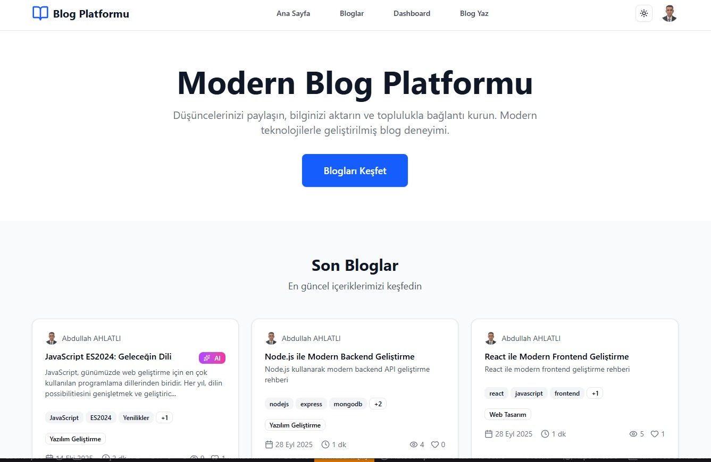

# Blog API Backend

Modern bir blog sistemi için geliştirilmiş RESTful API. Node.js, Express.js, MongoDB ve JWT kullanılarak oluşturulmuştur.


## 🖥️ Ekran Görüntüleri



## 🚀 Özellikler

- **Kullanıcı Yönetimi**: Kayıt, giriş, profil yönetimi
- **Blog Sistemi**: CRUD işlemleri, kategoriler, etiketler
- **Güvenlik**: JWT authentication, şifre hashleme, rate limiting
- **API Dokümantasyonu**: Swagger UI entegrasyonu
- **Veri Doğrulama**: Express-validator ile input validation
- **Hata Yönetimi**: Merkezi hata yakalama sistemi
- **Frontend Web Uygulaması**: Next.js ile geliştirilmiş modern web arayüzü
- **Mobil Uygulama**: React Native ile geliştirilmiş cross-platform mobil uygulama

## 🛠️ Teknoloji Stack

### Backend

- **Backend**: Node.js, Express.js
- **Veritabanı**: MongoDB, Mongoose
- **Authentication**: JSON Web Token (JWT)
- **Şifreleme**: bcryptjs
- **API Dokümantasyonu**: Swagger UI
- **Güvenlik**: Helmet, CORS, Rate Limiting
- **Validation**: Express-validator

### Frontend Web Uygulaması
- **Framework**: Next.js 15.5.4 (React 19.1.0)
- **Styling**: Tailwind CSS 4.x
- **UI Components**: Radix UI primitives
- **Form Management**: React Hook Form + Zod validation
- **HTTP Client**: Axios
- **Markdown**: React Markdown + Rehype plugins
- **Theme**: Next Themes (Dark/Light mode)
- **Icons**: Lucide React
- **Notifications**: Sonner

### Mobil Uygulama

- **Framework**: React Native 0.73.2
- **Navigation**: React Navigation 6.x
- **State Management**: Redux Toolkit
- **HTTP Client**: Axios
- **Storage**: AsyncStorage, MMKV, Keychain
- **UI Components**: React Native Elements
- **Rich Text**: Pell Rich Editor
- **Push Notifications**: Firebase Messaging
- **Image Handling**: Image Picker, Image Zoom Viewer

## 📦 Kurulum

### Gereksinimler

- Node.js (v14 veya üzeri)
- MongoDB (v4.4 veya üzeri)
- npm veya yarn

### Adımlar

1. **Projeyi klonlayın**

```bash
git clone <repository-url>
cd BE_WorkShop
```

2. **Bağımlılıkları yükleyin**

```bash
npm install
```

3. **Environment dosyasını oluşturun**

```bash
cp env.example .env
```

4. **Environment değişkenlerini düzenleyin**

```env
MONGODB_URI=mongodb://localhost:27017/blog-api
JWT_SECRET=your_super_secret_jwt_key_here
PORT=5000
```

5. **MongoDB'yi başlatın**

```bash
# MongoDB servisini başlatın (sistem bağımlı)
# Windows: net start MongoDB
# macOS: brew services start mongodb-community
# Linux: sudo systemctl start mongod
```

6. **Uygulamayı başlatın**

```bash
# Geliştirme modu
npm run dev

# Production modu
npm start
```

## 📚 API Endpoints

### Authentication

- `POST /api/auth/register` - Kullanıcı kaydı
- `POST /api/auth/login` - Kullanıcı girişi
- `GET /api/auth/me` - Profil bilgileri
- `PUT /api/auth/change-password` - Şifre değiştir

### Users

- `GET /api/users` - Tüm kullanıcılar (Admin)
- `GET /api/users/:id` - Tek kullanıcı
- `PUT /api/users/profile` - Profil güncelle
- `DELETE /api/users/:id` - Kullanıcı sil (Admin)
- `GET /api/users/:id/blogs` - Kullanıcının blogları

### Blogs

- `GET /api/blogs` - Tüm bloglar
- `GET /api/blogs/:slug` - Tek blog
- `POST /api/blogs` - Yeni blog oluştur
- `PUT /api/blogs/:id` - Blog güncelle
- `DELETE /api/blogs/:id` - Blog sil
- `GET /api/blogs/my-blogs` - Kendi bloglarım
- `POST /api/blogs/:id/like` - Blog beğen
- `GET /api/blogs/categories` - Kategoriler
- `GET /api/blogs/tags` - Popüler etiketler

## 📊 Otomatik Dokümantasyon Sistemi

Proje, otomatik dokümantasyon güncelleme sistemi ile donatılmıştır:

### Kullanılabilir Komutlar

```bash
npm run docs:analyze    # Proje analizi yapar
npm run docs:update     # Dokümantasyonu günceller
npm run docs:export     # Tüm formatlarda export eder
```

### Otomatik Oluşturulan Dosyalar

- `PROJECT_STATUS.md` - Markdown formatında proje durumu
- `PROJECT_STATUS.html` - HTML formatında proje durumu
- `api-endpoints.json` - JSON formatında endpoint listesi
- `PROJECT_RULES.md` - Proje kuralları ve standartları

### Yeni Endpoint Ekleme Süreci

1. Route dosyasına Swagger dokümantasyonu ekleyin
2. Controller fonksiyonunu oluşturun
3. Validation kurallarını ekleyin
4. Dokümantasyonu güncelleyin: `npm run docs:update`

Bu sistem sayesinde her endpoint değişikliği otomatik olarak dokümantasyona yansır.

## 👥 Kullanıcı Yönetimi

### MongoDB VS Code Extension

1. VS Code'da "MongoDB for VS Code" extension'ını kurun
2. Command Palette (Ctrl+Shift+P) → "MongoDB: Connect"
3. Bağlantı string'i: `mongodb://localhost:27017/blog-api`
4. Database adı: `blog_api`

### Admin Kullanıcısı Oluşturma

```bash
# Yeni admin kullanıcısı oluştur
npm run create-admin

# Mevcut kullanıcıyı admin yap
npm run make-admin -- --email=user@example.com
```

### Kullanıcı Yönetimi CLI

```bash
# Tüm kullanıcıları listele
npm run users:list

# Kullanıcı detayları
npm run users:details admin@user.com

# Kullanıcıyı admin yap
npm run users:make-admin admin@user.com

# Kullanıcıyı user yap
npm run users:make-user admin@user.com

# Kullanıcı durumunu değiştir (aktif/pasif)
npm run users:toggle admin@user.com

# Kullanıcıyı sil
npm run users:delete admin@user.com
```

### Mevcut Admin Kullanıcıları

- **admin@example.com** / admin123456
- **admin@user.com** / 123456 (Abdullah AHLATLI)

## 📮 Postman API Test

### Postman Collection Kurulumu

1. **Postman'i indirin**: [postman.com](https://www.postman.com/downloads/)
2. **Collection'ı import edin**: `postman/Blog_API_Collection.json`
3. **Environment'ı import edin**: `postman/Blog_API_Environment.json`
4. **Environment'ı aktif hale getirin**
5. **Server'ı başlatın**: `npm run dev`

### Test Sırası

1. **Health Check** - Server durumunu kontrol et
2. **Login** - Admin kullanıcısı ile giriş yap
3. **Get Me** - Profil bilgilerini getir
4. **Get All Blogs** - Blog listesini getir
5. **Get Blog by Slug** - Tek blog detayını getir
6. **Get Categories** - Blog kategorilerini getir
7. **Get Popular Tags** - Popüler etiketleri getir
8. **Create Blog** - Yeni blog oluştur

### Test Verileri

```bash
# Test blog verilerini oluştur
npm run seed
```

Bu komut 5 adet test blogu oluşturur:

- Node.js ile Modern Backend Geliştirme
- React ile Modern Frontend Geliştirme
- MongoDB Veritabanı Tasarımı
- Docker ile Containerization
- JavaScript ES6+ Özellikleri

### Token Yönetimi

- Login sonrası `accessToken` ve `refreshToken` otomatik kaydedilir
- Token süresi: **7 gün** (access), **30 gün** (refresh)
- Token yenileme: `POST /api/auth/refresh`

### Örnek Login Response

```json
{
  "status": "success",
  "message": "Giriş başarılı",
  "data": {
    "user": {
      "id": "68d43bb0700e941df8e4b488",
      "name": "Abdullah AHLATLI",
      "email": "admin@user.com",
      "role": "admin"
    },
    "accessToken": {
      "token": "eyJhbGciOiJIUzI1NiIsInR5cCI6IkpXVCJ9...",
      "expiresAt": "2025-10-01T19:13:31.030Z",
      "expiresIn": "7d"
    },
    "refreshToken": {
      "token": "eyJhbGciOiJIUzI1NiIsInR5cCI6IkpXVCJ9...",
      "expiresAt": "2025-10-24T19:13:31.030Z"
    }
  }
}
```

## � Mobil Uüygulama

### Özellikler

- **Cross-Platform**: iOS ve Android desteği
- **Modern UI**: React Native Elements ile responsive tasarım
- **Offline Support**: AsyncStorage ve MMKV ile veri saklama
- **Rich Text Editor**: Blog yazma ve düzenleme
- **Image Management**: Fotoğraf yükleme ve görüntüleme
- **Push Notifications**: Firebase ile anlık bildirimler
- **Secure Storage**: Keychain ile güvenli token saklama
- **State Management**: Redux Toolkit ile merkezi state yönetimi

### Kurulum

#### Gereksinimler

- Node.js (v18 veya üzeri)
- React Native CLI
- Android Studio (Android için)
- Xcode (iOS için)

#### Adımlar

1. **Mobil uygulama dizinine gidin**

```bash
cd blog-mobile-app
```

2. **Bağımlılıkları yükleyin**

```bash
npm install
```

3. **iOS için (macOS gerekli)**

```bash
cd ios && pod install && cd ..
npm run ios
```

4. **Android için**

```bash
npm run android
```

### Geliştirme Komutları

```bash
npm start              # Metro bundler başlat
npm run android        # Android emulator'da çalıştır
npm run ios           # iOS simulator'da çalıştır
npm run lint          # ESLint kontrolü
npm run test          # Jest testleri çalıştır
npm run typecheck     # TypeScript kontrolü
npm run build:android # Android APK oluştur
npm run clean         # Cache temizle
```

### Proje Yapısı

```
blog-mobile-app/
├── src/
│   ├── components/    # UI bileşenleri
│   ├── screens/       # Ekran bileşenleri
│   ├── navigation/    # Navigation yapısı
│   ├── store/         # Redux store
│   ├── services/      # API servisleri
│   ├── utils/         # Yardımcı fonksiyonlar
│   └── constants/     # Sabitler ve tema
├── android/           # Android native kod
├── ios/              # iOS native kod
└── __tests__/        # Test dosyaları
```

## 📖 API Dokümantasyonu

Uygulama çalıştıktan sonra Swagger UI'ya erişebilirsiniz:

```
http://localhost:5000/api-docs
```

## 🔧 Geliştirme

### Proje Yapısı

```
src/
├── config/          # Veritabanı ve Swagger konfigürasyonu
├── controllers/     # Route handler'ları
├── middleware/      # Authentication, validation, error handling
├── models/          # MongoDB şemaları
├── routes/          # API route'ları
└── uploads/         # Yüklenen dosyalar
```

### Script'ler

```bash
npm start          # Production modunda başlat
npm run dev        # Geliştirme modunda başlat (nodemon)
npm test           # Testleri çalıştır
```

### Environment Değişkenleri

```env
MONGODB_URI        # MongoDB bağlantı string'i
JWT_SECRET         # JWT imzalama anahtarı
JWT_EXPIRE         # Token süresi
PORT               # Server portu
NODE_ENV           # Environment (development/production)
```

## 🔐 Güvenlik

- **JWT Authentication**: Token tabanlı kimlik doğrulama
- **Password Hashing**: bcrypt ile şifre hashleme
- **Rate Limiting**: API isteklerini sınırlama
- **CORS**: Cross-origin resource sharing kontrolü
- **Helmet**: HTTP header güvenliği
- **Input Validation**: Express-validator ile veri doğrulama

## 🚀 Deployment

### Production Hazırlığı

1. `NODE_ENV=production` ayarlayın
2. Güçlü bir `JWT_SECRET` oluşturun
3. MongoDB connection string'ini güncelleyin
4. Rate limiting ayarlarını optimize edin

### Docker (Opsiyonel)

```dockerfile
FROM node:18-alpine
WORKDIR /app
COPY package*.json ./
RUN npm ci --only=production
COPY . .
EXPOSE 5000
CMD ["npm", "start"]
```

## 📝 Lisans

MIT License

## 👥 Katkıda Bulunma

1. Fork yapın
2. Feature branch oluşturun (`git checkout -b feature/amazing-feature`)
3. Commit yapın (`git commit -m 'Add amazing feature'`)
4. Push yapın (`git push origin feature/amazing-feature`)
5. Pull Request açın

## 📞 İletişim

- **Geliştirici**: Abdullah AHLATLI
- **E-posta**: ahlatlipost@gmail.com

---

## 🎯 Proje Durumu

Bu proje, modern web ve mobil uygulama geliştirme teknolojilerini kullanarak tam kapsamlı bir blog sistemi oluşturmayı amaçlamaktadır.

### Tamamlanan Özellikler

- ✅ RESTful API Backend (Node.js + Express)
- ✅ MongoDB veritabanı entegrasyonu
- ✅ JWT Authentication sistemi
- ✅ Swagger API dokümantasyonu
- ✅ Next.js Frontend Web Uygulaması
- ✅ React Native mobil uygulama
- ✅ Cross-platform mobil destek (iOS/Android)
- ✅ Redux state management
- ✅ Rich text editor
- ✅ Image upload/management
- ✅ Push notifications
- ✅ Dark/Light mode desteği
- ✅ Responsive tasarım

### Yapılacaklar

- 🔄 Jest ile unit ve integration testler
- 🔄 Multer ile dosya yükleme sistemi
- 🔄 Nodemailer ile email sistemi
- 🔄 Redis ile caching
- 🔄 Winston ile logging sistemi
- 🔄 Health check monitoring
- 🔄 Admin paneli geliştirmeleri

**Not**: Bu proje eğitim amaçlı geliştirilmiştir. Production kullanımı için ek güvenlik önlemleri alınması önerilir.

Herhangi bir özellik eklemek veya mevcut kodu geliştirmek isterseniz, Cursor'da AI chat'i kullanarak kolayca ilerleyebilirsiniz!
